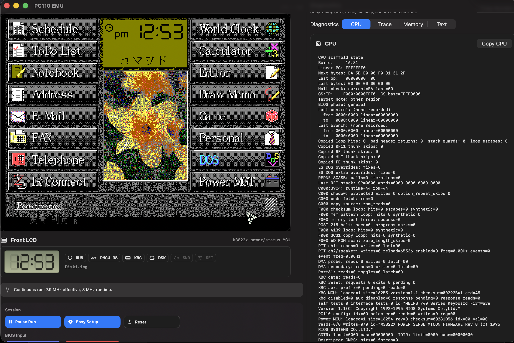
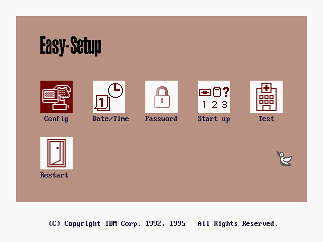
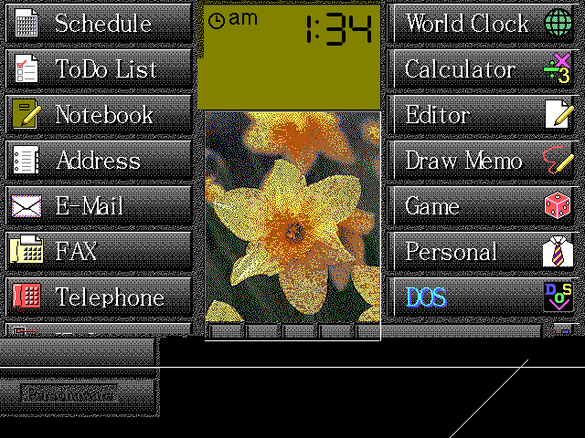
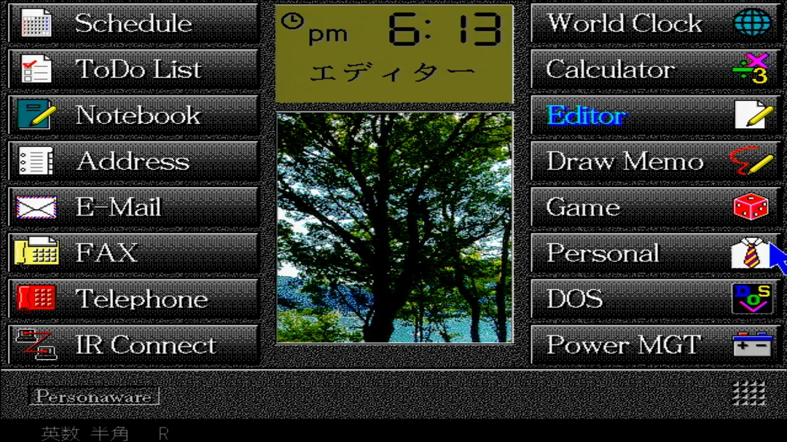

# PC110 EMU

An experimental IBM Palm Top PC 110 emulator built around the real machine ROMs, PC DOS boot flow, Personaware, Easy-Setup, keyboard and power microcontroller dumps, and the tiny front LCD status panel.

The project now has two frontends:

- A polished native macOS SwiftUI app for bring-up, diagnostics, and day-to-day hacking.
- A portable CMake build for Linux, Windows, and macOS with a headless runner and an optional SDL2 interactive frontend.



## Highlights

- Boots the real PC110 BIOS from `Roms/pc110_bios.bin`.
- Runs PC DOS startup paths and supported Personaware disk images.
- Renders the Personaware launcher, including repaired menu text metrics and Japanese DBCS glyphs from the PC110 font flash.
- Opens the ROM-backed graphical BIOS Easy-Setup path.
- Routes keyboard and mouse input into the BIOS setup menu and Personaware launcher.
- Loads the M3822x power-sense MCU firmware and MELPS 740 keyboard-controller firmware.
- Shows a front LCD status strip with the startup `IBM` segment display, time, disk, PMCU, KBC, speaker, and setup state.
- Provides copy-ready diagnostics for CPU state, traces, memory, and text screens.
- Builds as a native macOS app or as portable C executables.

This is still a bring-up emulator. The fun part is that the real ROMs, boot media, controller firmware dumps, font data, mouse path, and diagnostics now participate in one visible machine model.

## Status

| Area | State |
| --- | --- |
| BIOS | Real PC110 BIOS loading and POST path scaffolding |
| Display | 640 x 480 framebuffer, BIOS setup rendering, Personaware launcher rendering |
| Storage | FAT/QPI/PQI-style boot image support used by the current PC DOS and Personaware path |
| Input | Keyboard text, raw key routing, mouse movement and clicks |
| Front LCD | Host-side status panel modeled after the PC110 front LCD behavior |
| MCU dumps | Power-sense and keyboard-controller ROMs loaded for diagnostics and controller responses |
| Platforms | macOS Swift app, portable CMake headless runner, optional SDL2 GUI |

## Repository Layout

```text
Sources/PC110Core/       C emulator core and public C API
Sources/PC110SimApp/     Native macOS SwiftUI/AppKit frontend
Sources/PC110Portable/   Portable C frontends for Linux, Windows, and macOS
Roms/                    Legally obtained PC110 ROM dumps
Disks/                   Boot media
Docs/images/             Screenshots and README images
Tools/                   Bring-up probes and framebuffer capture utilities
```

## Required Assets

Run from the repository root so relative ROM and disk paths resolve correctly.

Required:

```text
Roms/pc110_bios.bin
```

Strongly recommended:

```text
Roms/MSM538032E@SOP44.BIN
Roms/M38223E4HP@QFP80.BIN
Roms/M38813E4HP@QFP64.bin
```

What they do:

| File | Purpose |
| --- | --- |
| `MSM538032E@SOP44.BIN` | PC110 Japanese font flash used for DBCS glyph rendering |
| `M38223E4HP@QFP80.BIN` | M3822x power-sense MCU firmware, including the status/front-LCD family of behavior |
| `M38813E4HP@QFP64.bin` | MELPS 740 keyboard-controller firmware used by KBC diagnostics and command responses |

Environment overrides:

```text
PC110_FONT_ROM
PC110_MCU_FIRMWARE
PC110_MCU_ROM
PC110_KEYBOARD_MCU_FIRMWARE
PC110_KEYBOARD_MCU_ROM
```

Supported boot media lookup order:

```text
Disks/img.ZIP
Disks/Personaware.PQI
Disks/Disk1.PQI
Disks/disk1.pqi
Disks/disk1.qpi
Disks/Disk1.qpi
Disks/Disk1.QPI
Disks/Disk1.img
Disks/disk.img
```

For Personaware, prefer `Disks/disk1.qpi`, `Disks/Disk1.qpi`, or `Disks/Personaware.PQI`.

## Quick Start: Portable

Use this path on Linux, Windows, or macOS.

Requirements:

- CMake 3.20 or newer.
- A C99 compiler: GCC, Clang, AppleClang, or MSVC.
- Optional SDL2 development package for the interactive GUI.

Build:

```sh
cmake -S . -B build/portable
cmake --build build/portable
```

Run the dependency-free headless frontend:

```sh
build/portable/pc110emu-headless --frames 60 --out /tmp/pc110.bmp
```

Run the optional SDL2 frontend:

```sh
build/portable/pc110emu-sdl
```

On Windows, CMake generators may place binaries under a configuration directory:

```text
build/portable/Debug/pc110emu-headless.exe
build/portable/Debug/pc110emu-sdl.exe
```

Build only the headless runner:

```sh
cmake -S . -B build/portable -DPC110_BUILD_SDL=OFF
cmake --build build/portable
```

Useful portable options:

```sh
build/portable/pc110emu-sdl --bios Roms/pc110_bios.bin --boot Disks/Disk1.img
build/portable/pc110emu-sdl --ips 266666
build/portable/pc110emu-headless --setup --frames 10 --out /tmp/easy-setup.bmp
build/portable/pc110emu-headless --steps 1000000 --text --trace-tail 12000
```

Both portable frontends accept:

```text
--bios PATH
--boot PATH
--no-boot
--help
```

## Quick Start: macOS App

Requirements:

- macOS 13 or newer.
- Xcode Command Line Tools with Swift 5.9 or newer.

Install command line tools if needed:

```sh
xcode-select --install
```

Build and run:

```sh
swift build
swift run PC110EMU
```

For a clean Swift build:

```sh
swift package clean
swift build
```

The app reports BIOS, power MCU, keyboard MCU, selected boot disk, and runtime status. Press `Continue Run` to use gradual PC DOS boot pacing, then switch into the 8 MHz runtime path.

## Using The Emulator

### Boot Personaware

1. Put a supported Personaware image in `Disks/`.
2. Start `pc110emu-sdl` or `swift run PC110EMU`.
3. Confirm the status line reports a loaded BIOS and the expected boot disk.
4. Continue execution.
5. PC DOS enters the Personaware startup path and launches `MET.COM`.

The emulator repairs detected Personaware startup scripts in memory only. Disk images are not rewritten.

### BIOS Easy-Setup

The PC110's graphical Easy-Setup menu is entered through the ROM-backed setup path. In the macOS app, use `Easy Setup` or `F1 Setup`. In the portable headless runner, capture it with:

```sh
build/portable/pc110emu-headless --setup --frames 10 --out /tmp/easy-setup.bmp
```

Visible setup categories include:

- `Config`
- `Date/Time`
- `Password`
- `Start up`
- `Test`
- `Restart`

### Input

- Click the emulator display before typing in the macOS app.
- Printable ASCII keys are forwarded to the emulated machine.
- Control-key text input such as `Control-C` is forwarded when applicable.
- Mouse movement and button events are forwarded inside the emulated display.
- macOS Command and Option shortcuts remain reserved by the host app.

### Diagnostics

The macOS app includes a right-side diagnostics pane:

- `CPU`: registers, controller firmware status, ROM state, boot state, counters.
- `Trace`: accumulated trace output.
- `Memory`: formatted memory reads from a hex address.
- `Text`: active text-mode screen dump.

Useful buttons:

- `Copy Bundle`: CPU state, trace tail, and text screen.
- `Copy Text`: current text-mode diagnostics.
- `Clear Trace`: reset the trace log.
- `F1 Setup`: induce the BIOS F1 setup path and copy diagnostics.
- `Easy Setup`: open the ROM-backed Easy-Setup screen.

## Screenshots

Current macOS frontend with Personaware, diagnostics, and front LCD:


ROM-backed BIOS Easy-Setup:



Personaware launcher capture:



Original IBM PC110 reference:



## Developer Notes

Compile only the C core:

```sh
clang -std=c99 -Wall -I Sources/PC110Core/include -c Sources/PC110Core/pc110_core.c -o /tmp/pc110_core.o
```

Build all portable targets:

```sh
cmake -S . -B build/portable
cmake --build build/portable
```

Build the Swift frontend:

```sh
swift build
```

Capture a framebuffer with the legacy diagnostic tool:

```sh
clang -std=c99 -Wall -I Sources/PC110Core/include Tools/pc110_frame_dump.c Sources/PC110Core/pc110_core.c -o /tmp/pc110_frame_dump
/tmp/pc110_frame_dump /tmp/personaware.bmp boot 10000000 none 0
```

On macOS, convert BMP captures to PNG:

```sh
sips -s format png /tmp/personaware.bmp --out /tmp/personaware.png
sips -s format png /tmp/easy-setup.bmp --out /tmp/easy-setup.png
```

## Troubleshooting

| Symptom | What to check |
| --- | --- |
| `No BIOS loaded` | Confirm `Roms/pc110_bios.bin` exists and launch from the repository root. |
| `Power MCU: none` | Add `Roms/M38223E4HP@QFP80.BIN` or set `PC110_MCU_FIRMWARE`. |
| `Keyboard MCU: none` | Add `Roms/M38813E4HP@QFP64.bin` or set `PC110_KEYBOARD_MCU_FIRMWARE`. |
| `Boot disk: none` | Add a disk image using one of the supported filenames. |
| `Boot disk: Disk1.img` but Personaware was expected | Use `Disks/disk1.qpi`, `Disks/Disk1.qpi`, or `Disks/Personaware.PQI`. |
| Blank or stale display | Reset, then continue execution. |
| SDL target not built | Install SDL2 development files, or build with `-DPC110_BUILD_SDL=OFF` for headless only. |
| Windows binary path looks missing | Check `build/portable/Debug/` or `build/portable/Release/` depending on the generator. |

## Legal Note

PC110 EMU does not grant rights to IBM ROMs, firmware dumps, fonts, DOS, Personaware, or other copyrighted software. Use legally obtained images from hardware or media you own.
